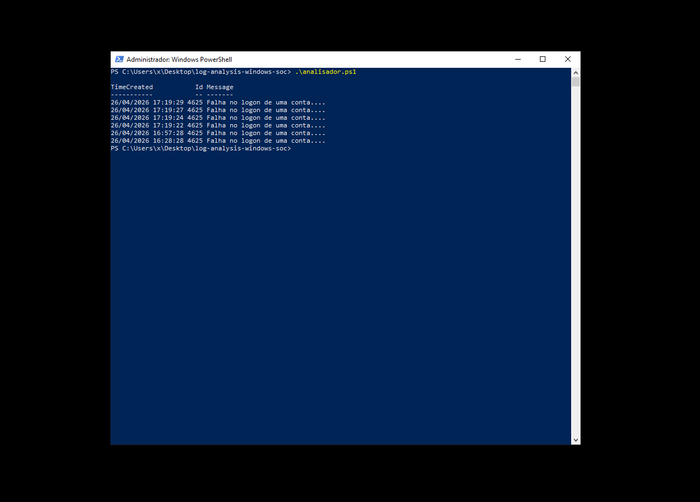

# 🔐 Windows Log Analysis - Failed Login Detection

## 📌 Sobre o projeto
Projeto simples de análise de logs de segurança do Windows, focado na identificação de tentativas de login falho.

## 🎯 Objetivo
Demonstrar habilidades básicas de:
- Análise de logs
- Segurança de sistemas
- Identificação de comportamento suspeito

## 🧰 Tecnologias
- PowerShell
- Windows Event Logs

## 🔍 Funcionamento
O script coleta eventos de segurança (ID 4625) e exibe informações relevantes para análise.

## 🚨 Possível ameaça detectada
Múltiplas falhas de login podem indicar:
- ataque de força bruta
- tentativa de acesso não autorizado

## 📸 Demonstração

### Resultado da análise

## 🧪 Teste realizado
Foram geradas tentativas de login falho manualmente para simular um cenário real.

## 📚 Base teórica
- Google Cybersecurity Certificate
- IBM Cybersecurity Analyst

## 📈 Próximos passos
- Contagem de eventos
- Geração de relatórios
- Automação de alertas